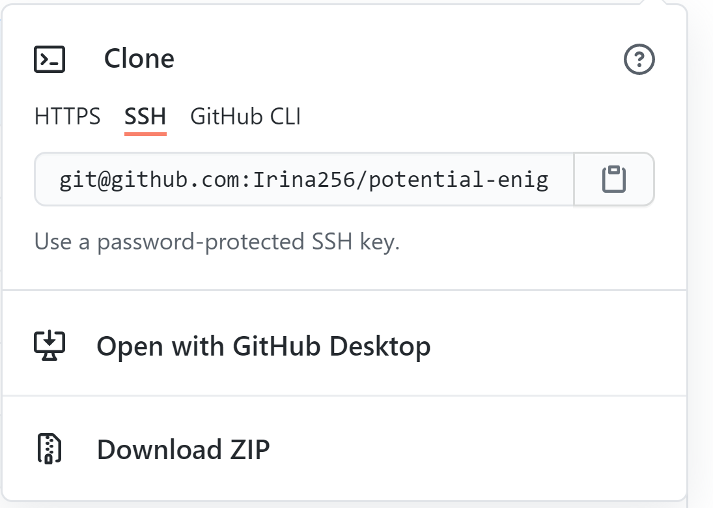
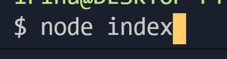

# README Generator

## Description

This app will generate a professional README.md file anyone could use for their projects and it's based on quick prompts.

## Table of Contents

- [Installation](#installation)
- [Usage](#usage)
- [Contributing](#contributers)
- [Tests](#tests)
- [Licenses](#licenses)

## Installation

To use that app the user should clone it to his machine

## Usage

This project is for anyone who wants a professional README.md file for his project!

## Credits

This application was developed by: Irina Skitayeva
GitHub: [Irina256](https://github.com/Irina256)
Email: [irina.skitayeva@gmail.com](irina.skitayeva@gmail.com)

## Licenses

This application is under the MIT license
undefined
;
https://choosealicense.com/licenses/MIT

## Tests

Here is a screenshot of testing readme file generator

